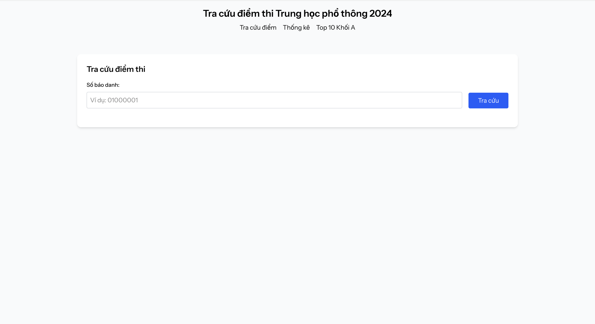

# Hệ thống tra cứu điểm thi THPT 2024

Hệ thống web tra cứu và thống kê điểm thi Trung học phổ thông quốc gia 2024, được phát triển cho internship tại [Golden Owl](https://goldenowl.asia).



## Demo

- **Live Demo**: [Sẽ cập nhật sau khi deploy]
- **Video Demo**: [Sẽ cập nhật]

## Cài đặt và chạy local

### 1. Clone repository

```bash
git clone <repository-url>
cd intern_GO
```

### 2. Cài đặt dependencies

```bash
# Backend dependencies
composer install

# Frontend dependencies  
npm install
```

### 3. Cấu hình môi trường

```bash
# Copy file .env
cp .env.example .env

# Generate application key
php artisan key:generate
```

### 4. Chuẩn bị database

```bash
# Tạo file SQLite database
touch database/database.sqlite

# Chạy migrations
php artisan migrate

# Import dữ liệu CSV (có thể mất vài phút)
php artisan db:seed --class=StudentScoreSeeder
```

### 5. Chạy development server
```bash
composer run dev
```

### 6. Truy cập ứng dụng

Mở trình duyệt và truy cập: **http://localhost:8000**
